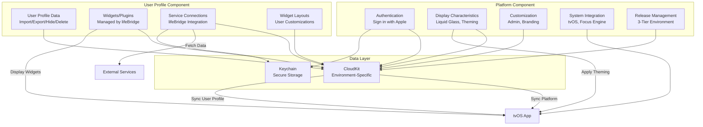

---name: "lifeBoard - Platform & User Profile Architecture"overview: Build lifeBoard with two-component architecture: Platform (authentication, base functionality, display characteristics, customization) and User Profile (user data, widgets, services). Aligned with Apple's platform/user model where Platform provides foundation and customization, User Profile contains all user-specific data and configurations.todos: []------name: "lifeBoard - Platform & User Profile Architecture"overview: Build lifeBoard with two-component architecture: Platform (authentication, base functionality, display characteristics, customization) and User Profile (user data, widgets, services). Aligned with Apple's platform/user model where Platform provides foundation and customization, User Profile contains all user-specific data and configurations.todos: []---

# lifeBoard - Command Center for Your Life

## Vision

**lifeBoard** is the tvOS application and Command Center positioned as the user's central hub for life management - a completely customizable dashboard with rich integrations to unlock limitless capabilities, empowering visual people to optimize their life.

## Value Proposition: Data Ownership & User Control

**Data ownership and sharing is the core value proposition for users.** Users own their profile - lifeBoard simply leverages it. This user-controlled data ownership is the foundation for how the scalable platform is structurally designed.

### Key Principles

- **User Ownership**: Users own their profile data - lifeBoard does not own or control user data
- **Leverage, Not Ownership**: lifeBoard leverages user profiles to provide services, but users maintain full ownership
- **Complete User Control**: Profiles can be imported, exported, hidden, or deleted - all user controlled
- **Scalable Foundation**: This data ownership model enables platform scalability and user trust
- **Portability**: Users can take their data anywhere - no vendor lock-in
- **Privacy First**: User data remains private and under user control at all times

## User Journey

The complete user experience flow:

1. **Sign in with Apple**: Initial authentication using Sign in with Apple
2. **Home Screen**: Populated with user's name, information from Apple Sign-in, and corresponding photo
3. **Service Linking**: Prompt with options to link Apple services (default all selected, user can deselect any)
4. **Widget Dashboard**: Home displays widgets (plugins) with key information about each selected service, dynamically resized through user-driven customization, mirroring tvOS native flow and feel - feeling like an extension of the system itself
5. **Navigation**: Use Apple Remote to click into applications to expand and view details
6. **Back Navigation**: Press back button to return to home dashboard
7. **Service Launching**: Start services like Music directly from dashboard
8. **Split View Configuration**: Configure split view for multi-service display
9. **Shortcuts Access**: Access and trigger Apple Shortcuts from dashboard
10. **Find My Integration**: Trigger notifications to devices using Find My network
11. **Profile Management**: Import, export, hide, or delete profile - complete user control over data ownership

## Project Overview

A multi-platform application designed to be the central hub for life management:

### Core Components (Two-Component Architecture)

The core of lifeBoard is structured around two fundamental components, aligned with Apple's platform/user model:

1. **Platform**: Base platform functionality, authentication, display characteristics, and customization capabilities
2. **User Profile**: All user-specific data, widgets, services, and user-controlled configurations

This structure mirrors Apple's design relationship between platform (foundation and customization) and user (personal data and configurations).

### Platform Component

**Platform** includes all base functionality and customization capabilities:

- **Authentication**: Sign in with Apple (identity establishment)
- **Base Platform Functionality**: Core infrastructure, release management, system integration
- **Display Characteristics**: Liquid Glass, theming, branding, visual customization
- **Customization Capabilities**: Admin control panel, theme editor, branding system
- **System Integration**: tvOS integration, Focus Engine, navigation patterns
- **Release Management**: Three-tiered environment system
- **Core Infrastructure**: CloudKit containers, security, app groups

### User Profile Component

**User Profile** includes all user-specific data and features:

- **User Data**: Profile information, preferences, settings
- **Widgets/Plugins**: All widgets managed through lifeBridge
- **Service Connections**: All service integrations and connections
- **Widget Layouts**: Dashboard configurations, widget positions, sizes
- **Data Ownership**: Import, export, hide, delete capabilities
- **Service Selections**: User's selected services and configurations
- **User Customizations**: Personal widget arrangements, preferences

### Plugin-Driven Architecture

Widgets and services are **plugin-driven** (widgets in Apple's terminology), managed through **lifeBridge** within the User Profile component:

- **lifeBoard** (tvOS application): The Command Center application that feels like an extension of the tvOS system itself. Widgets (plugins) are dynamically resized and customized through a user-driven process that mirrors Apple's best practices for tvOS. The app seamlessly integrates with the system, providing a native-like experience.
- **lifeBridge**: The connector within lifeBoard that manages all widgets/plugins. Widgets are added, configured, and customized through lifeBridge, enabling limitless extensibility while maintaining the simple core.
- **Widget System**: Plugin-driven widgets with dynamic resizing and user-driven customization, following Apple's tvOS design patterns
- **System Integration**: Designed to feel like a natural extension of tvOS, not a separate application
- **Shared codebase**: Common frameworks for both platforms
- **CloudKit sync**: Seamless data synchronization between devices
- **Liquid Glass**: Apple's latest design system integrated throughout for a premium, system-like experience
- **Apple Ecosystem Management**: Designed to be managed through the Apple ecosystem of devices
- **Scalable Architecture**: Engineered for scalable growth with detailed, context-rich release management
- **Three-Tiered Release System**: Development, Staging, and Production environments integrated into software design

## Architecture

### Project Structure

```javascript
lifeBoard.main/
├── LifeBoard.xcodeproj
├── LifeBoard/
│   ├── LifeBoardApp.swift (tvOS entry point - lifeBoard application and Command Center)
│   ├── Platform/
│   │   ├── Authentication/
│   │   │   ├── SignInView.swift
│   │   │   └── AuthenticationManager.swift
│   │   ├── Display/
│   │   │   ├── DisplayManager.swift
│   │   │   ├── ThemeEngine.swift
│   │   │   └── LiquidGlassRenderer.swift
│   │   ├── Customization/
│   │   │   ├── AdminPanelView.swift
│   │   │   ├── BrandingView.swift
│   │   │   ├── ThemeEditor.swift
│   │   │   ├── FontSelector.swift
│   │   │   ├── ColorPicker.swift
│   │   │   └── LogoBuilder.swift
│   │   ├── System/
│   │   │   ├── SystemIntegration.swift
│   │   │   ├── FocusEngineManager.swift
│   │   │   └── NavigationCoordinator.swift
│   │   └── Release/
│   │       ├── ReleaseManager.swift
│   │       └── EnvironmentConfig.swift
│   ├── UserProfile/
│   │   ├── Profile/
│   │   │   ├── ProfileManager.swift
│   │   │   ├── ProfileDataController.swift
│   │   │   ├── ProfileImportView.swift
│   │   │   ├── ProfileExportView.swift
│   │   │   ├── ProfileSettingsView.swift
│   │   │   └── UserProfileView.swift
│   │   ├── Widgets/
│   │   │   ├── WidgetGrid.swift
│   │   │   ├── WidgetView.swift
│   │   │   ├── WidgetResizer.swift
│   │   │   └── DashboardView.swift
│   │   ├── Services/
│   │   │   ├── ServiceLinkingView.swift
│   │   │   ├── ServiceLauncher.swift
│   │   │   └── ServiceExpansionView.swift
│   │   ├── Layouts/
│   │   │   ├── SplitView.swift
│   │   │   └── DashboardLayout.swift
│   │   └── Preferences/
│   │       ├── PreferencesView.swift
│   │       └── PreferencesManager.swift
│   ├── Home/
│   │   ├── HomeView.swift
│   │   └── WelcomeView.swift
│   ├── Services/
│   │   ├── ServiceLauncher.swift
│   │   ├── MusicService.swift
│   │   └── ServiceExpansionView.swift
│   ├── Shortcuts/
│   │   ├── ShortcutsView.swift
│   │   └── ShortcutsManager.swift
│   ├── FindMy/
│   │   ├── FindMyManager.swift
│   │   └── DeviceNotificationView.swift
│   └── Resources/
├── LifeBoardiOS/
│   ├── LifeBoardiOSApp.swift (iOS entry point - lifeBoard iOS companion)
│   ├── Platform/
│   │   ├── Customization/
│   │   │   ├── AdminPanelView.swift
│   │   │   ├── BrandingView.swift
│   │   │   ├── ThemeEditor.swift
│   │   │   ├── FontSelector.swift
│   │   │   ├── ColorPicker.swift
│   │   │   ├── LogoBuilder.swift
│   │   │   └── PreviewView.swift
│   │   └── Release/
│   │       └── ReleaseManagementView.swift
│   ├── UserProfile/
│   │   ├── Configuration/
│   │   │   ├── ConfigurationView.swift
│   │   │   ├── WidgetList.swift
│   │   │   └── WidgetEditor.swift
│   │   ├── Profile/
│   │   │   ├── ProfileManagementView.swift
│   │   │   ├── ProfileImportView.swift
│   │   │   └── ProfileExportView.swift
│   │   └── Services/
│   │       └── LifeBridgeView.swift
│   └── Resources/
├── LifeBoardCore/
│   ├── Platform/
│   │   ├── Models/
│   │   │   ├── Theme.swift
│   │   │   ├── BrandConfig.swift
│   │   │   └── DisplayConfig.swift
│   │   ├── Authentication/
│   │   │   └── AuthenticationManager.swift
│   │   ├── Display/
│   │   │   ├── ThemeManager.swift
│   │   │   ├── LiquidGlass.swift
│   │   │   └── DisplayEngine.swift
│   │   ├── Customization/
│   │   │   ├── BrandingManager.swift
│   │   │   └── CustomizationEngine.swift
│   │   ├── System/
│   │   │   └── SystemIntegrationManager.swift
│   │   └── Release/
│   │       ├── ReleaseManager.swift
│   │       ├── EnvironmentConfig.swift
│   │       ├── ReleaseContext.swift
│   │       └── VersionManager.swift
│   ├── UserProfile/
│   │   ├── Models/
│   │   │   ├── Widget.swift
│   │   │   ├── UserProfile.swift
│   │   │   ├── ServiceConfig.swift
│   │   │   ├── DashboardLayout.swift
│   │   │   ├── ServiceSelection.swift
│   │   │   └── ProfileExport.swift
│   │   ├── Profile/
│   │   │   └── ProfileDataManager.swift
│   │   ├── Widgets/
│   │   │   └── WidgetProvider.swift
│   │   └── Services/
│   │       └── ServiceManager.swift
│   ├── CloudKit/
│   │   ├── CloudKitManager.swift
│   │   └── CloudKitModels.swift
│   └── Shared/
│       └── SharedUtilities.swift
├── LifeBridge/
│   ├── LifeBridgeManager.swift (Integration application manager within lifeBoard)
│   ├── ServiceConnector.swift
│   ├── Protocols/
│   │   ├── BridgeableService.swift
│   │   └── ServiceAuthProtocol.swift
│   ├── Auth/
│   │   ├── SignInWithAppleHandler.swift (Sign in with Apple services integration)
│   │   ├── CompanionServiceAuth.swift (Sign in with Apple companion services)
│   │   ├── SignInWithGoogleHandler.swift (Sign in with Google for applications)
│   │   ├── GoogleWorkspaceAuth.swift (Google Workspace integrations)
│   │   ├── OAuthHandler.swift
│   │   ├── APIKeyHandler.swift
│   │   └── TokenManager.swift
│   └── Integrations/
│       ├── ServiceRegistry.swift
│       ├── WidgetManager.swift (Manages widgets/plugins through lifeBridge)
│       └── GoogleWorkspace/
│           ├── GoogleWorkspaceConnector.swift
│           └── GoogleWorkspaceServices.swift
├── LifeBoardModules/
│   ├── Calendar/
│   │   ├── CalendarModule.swift
│   │   └── CalendarView.swift
│   └── Base/
│       └── ModuleProtocol.swift
└── LifeBoardSecurity/
    ├── KeychainManager.swift
    └── CredentialStore.swift
└── Documentation/
    ├── LifeBoard.docc/
    │   ├── LifeBoard.md (Overview)
    │   ├── GettingStarted.md
    │   ├── Architecture.md
    │   └── Resources/
    ├── LifeBoardCore.docc/
    │   ├── LifeBoardCore.md
    │   └── Resources/
    ├── LifeBridge.docc/
    │   ├── LifeBridge.md
    │   ├── IntegrationGuide.md
    │   └── Resources/
    ├── Guides/
    │   ├── ModuleDevelopment.md
    │   ├── ThemeCustomization.md
    │   ├── SignInWithApple.md
    │   ├── SignInWithGoogle.md
    │   ├── GoogleWorkspace.md
    │   └── BestPractices.md
    └── Samples/
        ├── SampleModule/
        └── SampleIntegration/
```


### Data Flow




## Implementation Plan

### Phase 1: Project Setup & Core Infrastructure

1. **Xcode Project Structure**

- Create Xcode workspace with tvOS (lifeBoard) and iOS (lifeBoard iOS) targets
- Set up shared frameworks organized by Platform and UserProfile:
    - `LifeBoardCore/Platform/` - Platform component framework
    - `LifeBoardCore/UserProfile/` - User Profile component framework
    - `LifeBoardSecurity/` - Security framework (shared)
    - `LifeBridge/` - Integration connector (User Profile)
    - `LifeBoardWidgets/` - Widget system (User Profile)
- Configure CloudKit container and entitlements
- Set up app groups for shared keychain access
- Configure 'Sign in with Apple' capability (Platform)
- Configure 'Sign in with Google' OAuth (User Profile via lifeBridge)
- Configure Google Workspace API integration (User Profile via lifeBridge)
- Configure Apple Shortcuts API integration (User Profile)
- Configure Find My network integration (User Profile)
- Configure three-tiered release environment system (Platform)
- Set up release management architecture for scalable growth (Platform)
- Configure Apple ecosystem device management integration (Platform)

2. **CloudKit Setup**

- Create CloudKit schema for each environment (Development, Staging, Production):
    - **Platform Record Types**:
    - `Theme` record type (color scheme, Liquid Glass settings, typography)
    - `BrandConfig` record type (brand name, logo URL, primary colors, fonts)
    - `DisplayConfig` record type (display characteristics, customization settings)
    - `ReleaseContext` record type (version, build, environment, features, rollout info)
    - **User Profile Record Types**:
    - `UserProfile` record type (name, email, photo URL from Apple Sign-in, ownership metadata)
    - `Widget` record type (name, type, position, size, config) - plugin/widget data
    - `ServiceConfig` record type (service type, credentials reference)
    - `DashboardLayout` record type (user widget layouts and preferences)
    - `ServiceSelection` record type (selected Apple services, user preferences)
    - `SplitViewConfig` record type (split view layout configurations)
    - `ProfileExport` record type (export metadata, timestamps, user control flags)
    - Profile data designed for import/export with user ownership metadata
- Implement `CloudKitManager` for sync operations with environment awareness
- Separate CloudKit containers or record zones for Platform vs User Profile data
- Set up CloudKit subscriptions for real-time updates per environment
- Environment-specific container configuration

3. **Security Foundation**

- Implement `KeychainManager` for secure credential storage
- Create `CredentialStore` protocol for service-specific credential handling
- Set up app group keychain sharing between iOS and tvOS
- Platform-level security for authentication
- User Profile-level security for service credentials

4. **Platform Component: Release Management Architecture**

- **Three-Tiered Environment System** (Platform):
    - **Development Environment**: Local development and testing
    - **Staging Environment**: Pre-production testing and validation
    - **Production Environment**: Live user-facing environment
- `ReleaseManager`: Central release management controller (Platform)
- `EnvironmentConfig`: Environment-specific configuration management (Platform)
- `ReleaseContext`: Context-rich release metadata and tracking (Platform)
- `VersionManager`: Version control and release versioning (Platform)
- **Context-Rich Release Process**:
    - Release notes and changelog generation
    - Feature flags and gradual rollouts
    - A/B testing support
    - Release analytics and monitoring
    - Rollback capabilities
- **Apple Ecosystem Integration**:
    - TestFlight integration for staging releases
    - App Store Connect integration for production
    - Device management through Apple ecosystem
    - Over-the-air update support
- **Scalable Growth Architecture**:
    - Environment-aware configuration
    - Feature toggles for gradual feature releases
    - Analytics and telemetry per environment
    - Performance monitoring and optimization
    - Database migration management per environment

### Phase 2: Platform Component Implementation

4. **Platform: Authentication Layer**

- `AuthenticationManager`: Sign in with Apple authentication (Platform)
- Identity establishment and session management
- Authentication state management
- Secure token handling
- Integration with Apple's authentication system

5. **Platform: Display Characteristics**

- `DisplayEngine`: Core display and rendering system (Platform)
- `ThemeManager`: Theme management and application (Platform)
- `LiquidGlass`: Liquid Glass effects implementation (Platform)
- Display configuration and customization
- Visual characteristics management
- System integration for display

6. **Platform: Customization Capabilities**

- `BrandingManager`: Branding and customization engine (Platform)
- `CustomizationEngine`: Customization system (Platform)
- Admin control panel for platform customization
- Theme editor, font selector, color picker
- Logo upload and branding management
- Platform-level customization controls

7. **Platform: System Integration**

- `SystemIntegrationManager`: tvOS system integration (Platform)
- Focus Engine integration
- Navigation patterns
- System-like behavior implementation
- Native tvOS experience

8. **Platform: Release Management System**

- **Three-Tiered Environment Configuration** (Platform):
    - Development: Local development, debugging, and unit testing
    - Staging: Integration testing, QA validation, beta testing
    - Production: Live environment with real users
- Environment-specific CloudKit containers
- Environment-aware API endpoints and service configurations
- Feature flags and gradual rollout system
- Release context tracking (version, build, environment, features)
- Release analytics and telemetry
- A/B testing framework integration
- Rollback and emergency release capabilities
- Apple ecosystem device management (TestFlight, App Store Connect)

### Phase 3: User Profile Component Implementation

9. **User Profile: Profile Data Management**

- `ProfileDataManager`: User profile data management (User Profile)
- User profile information (name, email, photo from Apple Sign-in)
- Profile import/export/hide/delete capabilities
- Data ownership foundation
- User-controlled data management

10. **User Profile: Widget System (Plugin-Driven)**

    - `WidgetProtocol`: Widget interface definition (User Profile)
    - `id`, `name`, `type`, `position`, `size` (for dynamic resizing)
    - `fetchData()` async method
    - `view()` SwiftUI view builder
    - `resize()` method for user-driven dynamic resizing
    - `WidgetProvider`: Factory for widget instantiation (User Profile)
    - Widgets are plugins managed through lifeBridge
    - `Widget` struct conforming to `Codable` and `Identifiable` (User Profile)
    - Support for dynamic sizing (small, medium, large, custom)
    - User-driven customization metadata

11. **User Profile: Service Connections**

    - `ServiceManager`: Service connection management (User Profile)
    - Service configurations and connections
    - Service selection and preferences
    - Service state management
    - Integration with lifeBridge

### Phase 3.5: User Profile - lifeBridge Integration

11a. **User Profile: lifeBridge Architecture (Widget/Plugin Manager)**

- **lifeBridge is the connector within User Profile that manages all widgets/plugins**
- `LifeBridgeManager`: Central manager for service connections and widget management (User Profile)
- `WidgetManager`: Manages widgets/plugins - adding, configuring, and customizing through lifeBridge (User Profile)
- `ServiceConnector`: Protocol-based connector for different service types (User Profile)
- `BridgeableService`: Protocol that services must conform to (User Profile)
- `ServiceAuthProtocol`: Authentication protocol for OAuth, API keys, etc. (User Profile)
- `ServiceRegistry`: Registry of available service integrations and widgets (User Profile)
- Widget discovery and installation through lifeBridge (User Profile)

11b. **User Profile: lifeBridge Authentication & Integrations**

- **Sign in with Apple Services**: Primary integration method (User Profile via lifeBridge)
    - `SignInWithAppleHandler`: Sign in with Apple authentication flow (User Profile)
    - `CompanionServiceAuth`: Sign in with Apple companion services integration (User Profile)
- **Sign in with Google**: Secondary integration method for applications (User Profile)
    - `SignInWithGoogleHandler`: Sign in with Google OAuth flow for applications (User Profile)
    - Google OAuth 2.0 authentication for third-party applications (User Profile)
    - Support for adding applications that use Sign in with Google (User Profile)
    - Token management and refresh for Google OAuth (User Profile)
- **Google Workspace Integrations**: Tertiary integration method (User Profile)
    - `GoogleWorkspaceAuth`: Google Workspace OAuth and authentication (User Profile)
    - `GoogleWorkspaceConnector`: Connection manager for Google Workspace services (User Profile)
    - `GoogleWorkspaceServices`: Integration with Gmail, Calendar, Drive, etc. (User Profile)
- `OAuthHandler`: OAuth 2.0 flow management (iOS-only UI flows) (User Profile)
- `APIKeyHandler`: API key storage and validation (User Profile)
- `TokenManager`: Token refresh and management (User Profile)
- Integration with KeychainManager for secure storage (User Profile)
- Support for multiple authentication methods per service (User Profile)
- Connection state management (enabled/disabled) synced to CloudKit (User Profile)

11c. **User Profile: lifeBridge iOS Management**

- All service linking and enabling happens in iOS app (User Profile)
- Connection configurations stored in CloudKit (User Profile)
- Enabled/disabled state per service (User Profile)
- Service discovery and catalog (User Profile)
- Connection health monitoring (User Profile)
- Sign in with Apple and Google Workspace connection flows (User Profile)

### Phase 4: Platform Component - Display & Customization

12. **Platform: Programmatic Design System Foundation**

- `DesignSystem.swift`: Singleton source of truth for all visual constants (Platform)
- **Spacing & Layout**: 8pt baseline grid system
    - Standard padding: compact (8pt), regular (16pt), large (24pt), section (40pt)
    - Corner radii: small (8pt), card (24pt), window (40pt)
- **Colors (Semantic)**: No hex codes in Views - all colors defined semantically in DesignSystem
    - Glass Palette: Opacity levels for white/black layers (10%, 20%, 40%, 60%, 80%)
    - Gradients: Aurora background gradients defined as constants
- **Typography (SF Pro)**: Font.system with precise tracking
    - Display: Large, tight tracking (-1.0)
    - Body: Readable, standard tracking
    - Caption: Uppercase, wide tracking (+1.0), reduced opacity
- `Theme` model: Color schemes, typography, spacing, Liquid Glass intensity (Platform)
- `BrandConfig` model: Brand name, programmatic logo (SwiftUI Shapes), brand colors, custom fonts (Platform)
- `ThemeManager`: Singleton for theme application and updates (Platform)
- Support for SF Symbols exclusively for iconography (Platform)
- Dynamic color adaptation for light/dark modes (Platform)
- Display characteristics management (Platform)

13. **Platform: Liquid Glass Implementation (Programmatic)**

- `LiquidGlassModifier.swift`: Custom ViewModifier named `.liquidGlass()` (Platform)
- **Base**: Use `.ultraThinMaterial` or `.thinMaterial`
- **Texture**: Add subtle white overlay (5-10% opacity) to mimic reflection
- **Border**: Add high-opacity (20-30%) thin border (1px) to define edges
- **Shadow**: Deep, soft shadows for depth
- **Corner Radius**: 32px (card radius from DesignSystem)
- Performance-optimized rendering for tvOS (Platform)
- Integration with Focus Engine for interactive glass effects (Platform)
- Background blur and vibrancy controls (Platform)
- Display characteristics as platform capability

14. **Platform: tvOS Focus Engine Strategy (Programmatic)**

- `FocusableCard.swift`: Wrapper view that handles tvOS focus state automatically (Platform)
- **Default State**: Scale 1.0, standard shadow, standard border
- **Focused State**: Scale 1.1, "Bloom" shadow (larger radius, higher opacity), brighter border
- **Animation**: Use `.spring(response: 0.3, dampingFraction: 0.6)` for "heavy" physics feel
- **Parallax**: Optional `.hoverEffect(.lift)` if native behavior is insufficient
- Integration with LiquidGlassModifier for consistent glass effects
- All widgets use FocusableCard wrapper for consistent focus behavior

15. **Platform: Aurora Background Implementation (Programmatic)**

- `AuroraBackground.swift`: Programmatic animated background using SwiftUI Shapes (Platform)
- **Primary Aurora**: Blue gradient circle (60% width, 60% height), 30% opacity, 120px blur radius
- **Secondary Aurora**: Purple gradient circle (60% width, 60% height), 30% opacity, 120px blur radius
- **Accent Aurora**: Pink gradient circle (40% width, 40% height), 20% opacity, 100px blur radius
- **Animation**: Pulsing effect with 8-12 second duration cycles using `TimelineView`
- **Positioning**: Offset from center (-10% to +20% from edges)
- **Background**: Pure black (Color.black)
- **Implementation**: All gradients defined in DesignSystem.swift as constants
- **No Static Assets**: Entirely programmatic using SwiftUI Shapes (Circle) and Canvas if needed

### Phase 5: Platform Component - Admin & Customization (iOS)

14. **Platform: Admin Panel Interface (iOS)**

- `AdminPanelView`: Main administrative dashboard (Platform)
- `BrandingView`: Comprehensive branding configuration screen (Platform)
- `ThemeEditor`: Visual theme customization interface (Platform)
- `FontSelector`: Font family and size selection (SF Pro, custom fonts) (Platform)
- `ColorPicker`: Advanced color selection with accessibility preview (Platform)
- `LogoBuilder`: Programmatic logo builder using SwiftUI Shapes (Platform) - no image uploads
- `PreviewView`: Real-time preview of branding changes (Platform)

15. **Platform: Branding Features**

- Primary and secondary color selection (Platform)
- Accent color configuration (Platform)
- Custom font configuration (Platform)
- Programmatic logo builder with multiple size variants using SwiftUI Shapes (Platform)
- Liquid Glass intensity and style controls (Platform)
- Platformization settings (app name, bundle customization) (Platform)
- Export/import branding presets (Platform)
- Version control for branding changes (Platform)
- Display characteristics customization (Platform)

16. **Platform: CloudKit Integration (iOS)**

    - Write branding and theme data to CloudKit (Platform)
    - Write display configuration to CloudKit (Platform)
    - Handle platform-level data sync
    - Real-time sync status indicators
    - Background sync for branding updates
    - Platform customization sync to tvOS

### Phase 6: User Profile Component - iOS Interface

17. **User Profile: Configuration Interface (iOS)**

    - `ConfigurationView`: Main settings screen (User Profile)
    - `WidgetList`: Display and manage all widgets (managed through lifeBridge) (User Profile)
    - `WidgetEditor`: Add/edit widget configuration (User Profile)
    - Navigation between User Profile and Platform components

18. **User Profile: Preferences Management**

    - `PreferencesView`: User preferences interface (User Profile)
    - `PreferencesManager`: Manages user settings and preferences (User Profile)
    - Simple, focused preferences UI
    - User-specific settings and configurations

19. **User Profile: lifeBridge Widget Management (iOS Only)**

    - **Primary Interface**: All widgets/plugins are managed through lifeBridge in the iOS app (User Profile)
    - `LifeBridgeView`: Main lifeBridge interface for managing widgets and connecting services (User Profile)
    - `WidgetBrowser`: Browse available widgets/plugins (User Profile)
    - `WidgetInstaller`: Install and configure widgets through lifeBridge (User Profile)
    - `ServiceBrowser`: Browse available service integrations (User Profile)
    - `ServiceConnectionView`: Connect/disconnect services with enable/disable toggles (User Profile)
    - `AuthFlowView`: OAuth and authentication flow handling (User Profile)
    - `ServiceStatusView`: View connection status, health, and enabled state (User Profile)
    - `ServiceSettingsView`: Configure individual service settings and parameters (User Profile)
    - Connection state synced to CloudKit for tvOS consumption
    - Users can add widgets, link services, and enable/disable connections - all through lifeBridge

20. **User Profile: CloudKit Integration (iOS)**

    - Write widget configurations to CloudKit (User Profile)
    - Write service connection configurations to CloudKit (User Profile)
    - Write user profile data to CloudKit (User Profile)
    - Handle credential storage in Keychain (User Profile)
    - Real-time sync status indicators
    - Background sync for user profile updates
    - Sync widget and service states (enabled/disabled) for tvOS consumption

### Phase 7: Onboarding & User Journey

21. **Platform: Authentication Onboarding**

    - `SignInView`: Initial Sign in with Apple authentication screen (Platform)
    - **Exact Design Specifications**:
    - Layout: Centered vertical flex, 48px spacing between elements
    - Logo: 96x96px rounded-3xl glass panel with icon (48x48px)
    - Title: "lifeBoard" (64pt, semibold, white, tight tracking)
    - Subtitle: "Command Center" (20pt, white at 50% opacity)
    - Button: Sign in with Apple button
        - White background, black text
        - 48px horizontal padding, 16px vertical padding
        - 12px corner radius
        - 20pt semibold text
        - Apple logo icon (24x24px)
        - Focus: 110% scale, white glow shadow
    - Hint Text: "Press Enter to connect" (14pt, white/40%, centered)
    - Spacing: 48px margin-top before button
    - Authentication flow and identity establishment (Platform)
    - Handle first-time vs returning user flows (Platform)
    - Seamless authentication experience (Platform)

22. **User Profile: Initial Setup**

    - Retrieve user name, email, and photo from Apple Sign-in (User Profile)
    - Store user profile information in CloudKit (User Profile)
    - `UserProfileView`: Display user name, info from Apple Sign-in, and photo (User Profile)
    - Personalized welcome message (User Profile)
    - Profile photo display with Liquid Glass effects (Platform display + User Profile data)

23. **User Profile: Service Linking Interface**

    - `ServiceLinkingView`: Service selection screen (User Profile)
    - Display all available Apple services (User Profile)
    - Default all services selected (User Profile)
    - Toggle selection for each service (User Profile)
    - Visual checkboxes/toggles with Focus Engine support
    - Save selections to CloudKit (User Profile)
    - Progress indicator for service linking

15. **Profile Management & Data Ownership**

    - `ProfileManager`: Central profile management controller
    - `ProfileDataController`: Handles profile data operations (import, export, hide, delete)
    - **Profile Import**: Import profile data from external sources
    - Support for standard profile formats (JSON, etc.)
    - Validation and data integrity checks
    - User confirmation before import
    - **Profile Export**: Export complete profile data
    - Export all user data in portable format
    - Include all service connections, preferences, and configurations
    - User-controlled export with clear data ownership
    - **Profile Hide**: Temporarily hide profile without deletion
    - Profile remains in system but not visible
    - User can unhide at any time
    - Data remains under user control
    - **Profile Delete**: Complete profile deletion
    - User-initiated deletion with confirmation
    - Complete data removal from CloudKit
    - Clear all associated service connections
    - User maintains ownership until deletion
    - **Data Ownership UI**: Clear indicators of user data ownership
    - Visual ownership indicators
    - Export/import controls always accessible
    - Privacy and control settings

### Phase 7.5: User Profile - Data Ownership

24. **User Profile: Data Ownership System**

    - **Data Ownership Architecture**: Foundation for scalable platform (User Profile)
    - User profile data structure with ownership metadata (User Profile)
    - Profile data stored in user-controlled CloudKit container (User Profile)
    - No vendor lock-in - data is portable (User Profile)
    - **Profile Import System** (User Profile)
    - `ProfileImportView`: Import interface with file selection (User Profile)
    - Profile data validation and parsing (User Profile)
    - Conflict resolution for existing data (User Profile)
    - User confirmation and preview before import (User Profile)
    - **Profile Export System** (User Profile)
    - `ProfileExportView`: Export interface with format selection (User Profile)
    - Complete profile data export (JSON, etc.) (User Profile)
    - Include all user data: profile, services, preferences, widgets (User Profile)
    - Export metadata and timestamps (User Profile)
    - User-controlled export process (User Profile)
    - **Profile Hide/Unhide** (User Profile)
    - Profile visibility toggle (User Profile)
    - Hidden profiles remain in system but not displayed (User Profile)
    - User can unhide at any time (User Profile)
    - Data remains accessible to user (User Profile)
    - **Profile Deletion** (User Profile)
    - User-initiated deletion with multi-step confirmation (User Profile)
    - Complete data removal from CloudKit (User Profile)
    - Clear all service connections and credentials (User Profile)
    - Export option before deletion (User Profile)
    - Irreversible deletion confirmation (User Profile)

25. **User Profile: Data Ownership UI/UX**

    - Profile settings screen with ownership controls (User Profile)
    - Clear visual indicators of data ownership (User Profile)
    - Export/import always accessible (User Profile)
    - Privacy controls and data visibility settings (User Profile)
    - User education about data ownership rights (User Profile)

### Phase 8: tvOS Dashboard App

26. **Platform + User Profile: Command Center Dashboard UI**

    - `DashboardView`: Main Command Center container (Platform display + User Profile widgets)
    - `WidgetGrid`: Focus Engine-enabled grid layout (User Profile widgets, Platform display characteristics)
    - **Grid System Specifications**:
    - Container: 3-column grid, 2-row grid
    - Gap: 32px between widgets
    - Widget Spans: Small widgets (1 column), Medium widgets (2 columns), Large widgets (3 columns)
    - Padding: 64px horizontal, 48px bottom, 96px top (for status bar)
    - SwiftUI Implementation: Use `LazyVGrid` with 3-column flexible grid, widget spans controlled by `gridItem` column span
    - `WidgetView`: Individual widget display wrapper (User Profile widgets, Platform Liquid Glass)
    - **Widget Card Structure**: 32px corner radius, overflow hidden, 300ms transitions
    - **Glossy Sheen Overlay**: Gradient from white/20% to transparent on focus
    - `WidgetResizer`: Dynamic resizing system for user-driven customization (User Profile)
    - **Status Bar**: Top of screen, 40px padding, time display (18pt, semibold, white/80%), icon group (20px icons, 16px spacing, 80% opacity)
    - **Greeting**: "Good Afternoon, [Name]" - 40pt semibold, white/90%
    - **Widget-Based Design**: Display widgets (plugins) with key information about each selected service (User Profile)
    - **System Extension Feel**: Mirror tvOS native flow and feel - feels like an extension of the system itself (Platform)
    - Implement tvOS Focus Engine for navigation following Apple's best practices (Platform)
    - Dynamic theme application from CloudKit (Platform)
    - Real-time branding updates (Platform)
    - **Visual-first design**: Optimized for visual people with rich data visualization (Platform display)
    - **User-driven customization**: Dynamic resizing and widget arrangement mirroring Apple's tvOS patterns (User Profile)
    - **Life optimization focus**: Widgets designed to help users optimize daily life (User Profile)
    - **lifeBridge integration**: Widgets managed through lifeBridge connector (User Profile)

27. **User Profile: Widget Rendering & Dynamic Resizing**

    - Dynamic widget loading from CloudKit (User Profile, managed through lifeBridge)
    - Async data fetching for each widget via lifeBridge (User Profile)
    - **Dynamic Resizing**: User-driven widget resizing (small, medium, large, custom) (User Profile)
    - Widget size persistence and restoration (User Profile)
    - Error handling and loading states (User Profile)
    - Refresh mechanism (User Profile)
    - Liquid Glass effects on widget cards (Platform display characteristics)
    - Branded typography and colors (Platform display characteristics)
    - **System-like behavior**: Widgets behave like native tvOS widgets (Platform + User Profile)
    - **Note**: lifeBoard (tvOS) consumes widgets through lifeBridge but does not manage them (management is iOS-only)
    - **Widget-Specific Design Patterns**:
    - **Weather Widget**: Vertical flex, space-between, location (primary text), condition (secondary), 72pt temperature, 24px padding
    - **Music Widget**: Gradient background (pink-500/20 to purple-900/40), icon badge (48x48px), track title (20pt semibold), progress bar (1px height), album art blur effect
    - **Calendar Widget**: Vertical flex, 24px padding, "Up Next" header (red-400, uppercase), event list with 16px spacing, colored bars (1px width), current event full opacity, upcoming 50% opacity
    - **Home Widget**: Vertical flex space-between, 2-column grid (3px gap), grid items (white/5% bg, 12px padding), labels (uppercase, 12pt, white/50%)

28. **Platform: Navigation & System Integration**

    - `NavigationCoordinator`: Navigation state management (Platform)
    - Apple Remote click to expand applications (Platform)
    - Back button navigation to return to home (Platform)
    - Focus Engine navigation between widgets and expanded views (Platform)
    - **Focus Engine Specifications**:
    - Focus ring: 4px solid white at 40% opacity
    - Scale transformation: 105% when focused (5% increase)
    - Enhanced shadow: 50px blur radius, 20px vertical offset, 50% black opacity
    - Transition duration: 300ms with ease-in-out timing
    - Glossy sheen overlay: Gradient from white/20% to transparent on focus
    - SwiftUI Implementation: Use `@FocusState`, `.focusable()`, `.focusEffect()` for custom visuals
    - Smooth transitions with Liquid Glass effects (Platform display)
    - Deep linking support for service navigation (Platform)

29. **User Profile: Service Expansion & Launching**

    - `ServiceExpansionView`: Expanded view for selected service (User Profile)
    - `ServiceLauncher`: Service launch manager (User Profile)
    - Launch services like Music directly from dashboard (User Profile)
    - `MusicService`: Music app integration and launching (User Profile)
    - Background service management (User Profile)
    - Service state tracking (running/stopped) (User Profile)
    - Quick launch shortcuts from home screen (User Profile)

30. **User Profile: Split View Configuration**

    - `SplitView`: Multi-service split view implementation (User Profile)
    - Configure split view layouts (2-column, 3-column, custom) (User Profile)
    - Drag-and-drop service arrangement (User Profile)
    - Save split view configurations to CloudKit (User Profile)
    - Focus Engine support for split view navigation (Platform)
    - Real-time layout updates (User Profile)

31. **User Profile: Shortcuts Integration**

    - `ShortcutsView`: Apple Shortcuts interface (User Profile)
    - `ShortcutsManager`: Shortcuts API integration (User Profile)
    - Display available shortcuts from user's Shortcuts app (User Profile)
    - Trigger shortcuts from dashboard (User Profile)
    - Shortcut execution status and feedback (User Profile)
    - Favorite shortcuts quick access (User Profile)

32. **User Profile: Find My Integration**

    - `FindMyManager`: Find My network integration (User Profile)
    - `DeviceNotificationView`: Device notification interface (User Profile)
    - Trigger notifications to devices using Find My (User Profile)
    - Device selection and management (User Profile)
    - Notification delivery status (User Profile)
    - Integration with Apple's Find My network (User Profile)

### Phase 9: User Profile - Calendar Widget (Example Plugin Implementation)

33. **User Profile: Calendar Widget (Example Plugin)**

    - `CalendarWidget`: Implements `WidgetProtocol` (plugin/widget example) (User Profile)
    - `CalendarWidgetView`: SwiftUI view for calendar events with Liquid Glass (User Profile widget, Platform display)
    - EventKit integration for calendar access (User Profile)
    - CloudKit sync for calendar preferences (User Profile)
    - Branded styling integration (Platform display characteristics)
    - Dynamic resizing support (small, medium, large sizes) (User Profile)
    - User-driven customization options (User Profile)

34. **User Profile: Widget Registration**

    - Register Calendar widget in `WidgetProvider` (User Profile)
    - Add to available widgets list in iOS app (managed through lifeBridge) (User Profile)
    - Ensure widgets respect theme and branding (Platform display characteristics)
    - Widget discovery and installation through lifeBridge (User Profile)

### Phase 10: Polish & Security

26. **Security Enhancements**

    - Encrypt sensitive data in CloudKit
    - Secure credential retrieval in tvOS
    - Biometric authentication for iOS admin panel
    - Role-based access control for admin features

27. **tvOS Optimizations**

    - Focus Engine refinements with Liquid Glass interactions
    - **Animation Specifications**:
    - Standard transitions: 300ms duration, cubic-bezier(0.25, 0.46, 0.45, 0.94) timing curve
    - Screen transitions: 500-700ms duration with fade/slide effects
    - Focus animations: 100% → 105% scale, shadow enhancement (10px → 50px blur, 10px → 20px offset), sheen overlay 0% → 100% opacity
    - Background animations: Aurora pulses with 8-12 second cycles, opacity variations (20-30% range)
    - SwiftUI implementation: `.animation(.easeInOut(duration: 0.3), value: focusState)` for standard transitions
    - Custom timing: `Animation.timingCurve(0.25, 0.46, 0.45, 0.94, duration: 0.3)`
    - Siri Remote gesture support
    - Large text and accessibility support
    - Performance optimization for multiple modules
    - Liquid Glass rendering optimization (target 60fps)
    - Theme switching animations

28. **Apple Design Compliance**

    - Follow Human Interface Guidelines for tvOS
    - Implement proper Liquid Glass usage patterns
    - Ensure content-first design (branding doesn't distract)
    - Accessibility compliance (VoiceOver, Dynamic Type)
    - Proper use of SF Symbols and system fonts

### Phase 11: Apple-Grade Developer Documentation

29. **DocC Documentation**

    - Set up DocC documentation catalog
    - Create comprehensive API documentation for all public interfaces
    - Document all frameworks: LifeBoardCore, LifeBridge, LifeBoardWidgets, LifeBoardSecurity
    - Include code examples and sample code snippets
    - Add interactive tutorials and step-by-step guides
    - Document SwiftUI views and modifiers
    - Include architecture diagrams and visual documentation

30. **Architecture Documentation**

    - **Architecture Overview**: High-level system architecture documentation
    - **Widget System Guide**: How to create and integrate custom widgets/plugins
    - **lifeBridge Integration Guide**: How to integrate services via lifeBridge
    - **Theme System Documentation**: How to customize branding and themes
    - **CloudKit Schema Documentation**: Data models and sync patterns
    - **Security Architecture**: Keychain, credential management, and security best practices
    - **Focus Engine Guide**: tvOS navigation and focus management patterns

31. **Integration Guides**

    - **Getting Started Guide**: Quick start for new developers
    - **Sign in with Apple Integration**: Step-by-step guide for Apple services
    - **Sign in with Google Integration**: Complete guide for adding applications with Sign in with Google
    - **Google Workspace Integration**: Complete guide for Google Workspace services
    - **Custom Widget Development**: Guide for creating new widgets/plugins
    - **Branding Customization**: Admin panel usage and branding guide
    - **API Reference**: Complete API documentation with examples

32. **Code Documentation Standards**

    - Inline documentation comments following Swift documentation standards
    - DocC-compatible documentation comments for all public APIs
    - Parameter documentation with examples
    - Return value documentation
    - Throwing method documentation
    - Property documentation with access levels
    - Protocol conformance documentation
    - Extension documentation

33. **Developer Resources**

    - **Sample Projects**: Complete sample implementations
    - **Code Snippets**: Reusable code examples
    - **Best Practices Guide**: Apple-style coding conventions and patterns
    - **Troubleshooting Guide**: Common issues and solutions
    - **Migration Guides**: Version migration documentation
    - **Performance Guidelines**: Optimization best practices
    - **Accessibility Guide**: Making modules accessible

## Key Files to Create

- `LifeBoard.xcodeproj` - Main Xcode project
- **Platform Component Models**:
- `LifeBoardCore/Platform/Models/Theme.swift` - Theme and branding model (Platform)
- `LifeBoardCore/Platform/Models/BrandConfig.swift` - Brand configuration model (Platform)
- `LifeBoardCore/Platform/Models/DisplayConfig.swift` - Display characteristics model (Platform)
- **User Profile Component Models**:
- `LifeBoardCore/UserProfile/Models/Widget.swift` - Core widget (plugin) data model (User Profile)
- `LifeBoardCore/UserProfile/Models/UserProfile.swift` - User profile model (Apple Sign-in data) (User Profile)
- `LifeBoardCore/UserProfile/Models/ServiceSelection.swift` - Service selection model (User Profile)
- `LifeBoardCore/UserProfile/Models/SplitViewConfig.swift` - Split view configuration model (User Profile)
- `LifeBoardCore/UserProfile/Models/ProfileExport.swift` - Profile export model (User Profile)
- **Platform Component**:
- `LifeBoardCore/Platform/Authentication/AuthenticationManager.swift` - Authentication manager (Platform)
- `LifeBoardCore/Platform/Display/DesignSystem.swift` - **Singleton source of truth for all visual constants** (spacing, colors, typography, gradients) (Platform)
- `LifeBoardCore/Platform/Display/LiquidGlassModifier.swift` - **Custom ViewModifier `.liquidGlass()`** for programmatic glass effects (Platform)
- `LifeBoardCore/Platform/Display/AuroraBackground.swift` - **Programmatic animated background** using SwiftUI Shapes (Platform)
- `LifeBoardCore/Platform/Display/ThemeManager.swift` - Theme management singleton (Platform)
- `LifeBoardCore/Platform/Display/DisplayEngine.swift` - Display engine (Platform)
- `LifeBoardCore/Platform/System/FocusableCard.swift` - **tvOS focus wrapper view** that handles focus state automatically (Platform)
- `LifeBoardCore/Platform/Customization/BrandingManager.swift` - Branding manager (Platform)
- `LifeBoardCore/Platform/System/SystemIntegrationManager.swift` - System integration (Platform)
- `LifeBoardCore/Platform/Release/ReleaseManager.swift` - Release management controller (Platform)
- `LifeBoardCore/Platform/Release/EnvironmentConfig.swift` - Three-tiered environment configuration (Platform)
- `LifeBoardCore/Platform/Release/ReleaseContext.swift` - Context-rich release metadata (Platform)
- `LifeBoardCore/Platform/Release/VersionManager.swift` - Version control and release versioning (Platform)
- **User Profile Component**:
- `LifeBoardCore/UserProfile/Profile/ProfileDataManager.swift` - Profile data manager (User Profile)
- `LifeBoardCore/UserProfile/Widgets/WidgetProvider.swift` - Widget provider (User Profile)
- `LifeBoardCore/UserProfile/Services/ServiceManager.swift` - Service manager (User Profile)
- **Shared**:
- `LifeBoardCore/CloudKit/CloudKitManager.swift` - CloudKit sync manager (shared)
- `LifeBoardSecurity/KeychainManager.swift` - Secure credential storage
- **User Profile - lifeBridge**:
- `LifeBridge/LifeBridgeManager.swift` - lifeBridge integration manager (User Profile)
- `LifeBridge/ServiceConnector.swift` - Service connector protocol implementation (User Profile)
- `LifeBridge/Auth/SignInWithAppleHandler.swift` - Sign in with Apple services handler (User Profile)
- `LifeBridge/Auth/CompanionServiceAuth.swift` - Sign in with Apple companion services integration (User Profile)
- `LifeBridge/Auth/SignInWithGoogleHandler.swift` - Sign in with Google handler for applications (User Profile)
- `LifeBridge/Auth/GoogleWorkspaceAuth.swift` - Google Workspace authentication handler (User Profile)
- `LifeBridge/Integrations/GoogleWorkspace/GoogleWorkspaceConnector.swift` - Google Workspace connection manager (User Profile)
- `LifeBridge/Auth/OAuthHandler.swift` - OAuth authentication handler (User Profile)
- `LifeBridge/Integrations/ServiceRegistry.swift` - Service registry (User Profile)
- `LifeBridge/Integrations/WidgetManager.swift` - Widget/plugin manager (User Profile)
- `LifeBoardWidgets/Base/WidgetProtocol.swift` - Widget (plugin) interface
- `LifeBoardWidgets/Base/WidgetProvider.swift` - Widget provider
- **Platform Component (tvOS)**:
- `LifeBoard/LifeBoardApp.swift` - lifeBoard tvOS application and Command Center entry point
- `LifeBoard/Platform/Authentication/SignInView.swift` - Sign in with Apple onboarding screen (Platform)
- `LifeBoard/Platform/Authentication/AuthenticationManager.swift` - Authentication manager (Platform)
- `LifeBoard/Platform/Display/DisplayManager.swift` - Display characteristics manager (Platform)
- `LifeBoard/Platform/Display/ThemeEngine.swift` - Theme engine (Platform)
- `LifeBoard/Platform/Display/LiquidGlassRenderer.swift` - Liquid Glass renderer (Platform)
- `LifeBoard/Platform/Customization/AdminPanelView.swift` - Admin panel (Platform)
- `LifeBoard/Platform/Customization/BrandingView.swift` - Branding configuration (Platform)
- `LifeBoard/Platform/System/SystemIntegration.swift` - System integration (Platform)
- `LifeBoard/Platform/System/FocusEngineManager.swift` - Focus Engine manager (Platform)
- `LifeBoard/Platform/System/NavigationCoordinator.swift` - Navigation state management (Platform)
- **User Profile Component (tvOS)**:
- `LifeBoard/UserProfile/Profile/ProfileManager.swift` - Profile management controller (User Profile)
- `LifeBoard/UserProfile/Profile/ProfileDataController.swift` - Profile data operations (import, export, hide, delete) (User Profile)
- `LifeBoard/UserProfile/Profile/UserProfileView.swift` - User profile display with Apple Sign-in info (User Profile)
- `LifeBoard/UserProfile/Widgets/WidgetGrid.swift` - Widget grid layout (User Profile)
- `LifeBoard/UserProfile/Widgets/WidgetView.swift` - Individual widget display (User Profile)
- `LifeBoard/UserProfile/Widgets/WidgetResizer.swift` - Dynamic widget resizing (User Profile)
- `LifeBoard/UserProfile/Widgets/DashboardView.swift` - Main Command Center dashboard (User Profile widgets, Platform display)
- `LifeBoard/UserProfile/Services/ServiceLinkingView.swift` - Service selection and linking interface (User Profile)
- `LifeBoard/UserProfile/Services/ServiceLauncher.swift` - Service launching manager (User Profile)
- `LifeBoard/UserProfile/Layouts/SplitView.swift` - Split view configuration and display (User Profile)
- `LifeBoard/Services/ServiceLauncher.swift` - Service launching manager
- `LifeBoard/Services/MusicService.swift` - Music service integration
- `LifeBoard/Shortcuts/ShortcutsView.swift` - Apple Shortcuts interface
- `LifeBoard/Shortcuts/ShortcutsManager.swift` - Shortcuts API integration
- `LifeBoard/FindMy/FindMyManager.swift` - Find My network integration
- **Platform Component (iOS)**:
- `LifeBoardiOS/Platform/Customization/AdminPanelView.swift` - Administrative panel entry point (Platform)
- `LifeBoardiOS/Platform/Customization/BrandingView.swift` - Branding configuration interface (Platform)
- `LifeBoardiOS/Platform/Customization/ThemeEditor.swift` - Visual theme editor (Platform)
- `LifeBoardiOS/Platform/Customization/FontSelector.swift` - Font selector (Platform)
- `LifeBoardiOS/Platform/Customization/ColorPicker.swift` - Color picker (Platform)
- `LifeBoardiOS/Platform/Customization/LogoBuilder.swift` - Programmatic logo builder using SwiftUI Shapes (Platform)
- `LifeBoardiOS/Platform/Customization/PreviewView.swift` - Real-time preview of changes (Platform)
- **User Profile Component (iOS)**:
- `LifeBoardiOS/UserProfile/Configuration/ConfigurationView.swift` - lifeBoard iOS config screen (User Profile)
- `LifeBoardiOS/UserProfile/Configuration/WidgetList.swift` - Widget list and management (User Profile)
- `LifeBoardiOS/UserProfile/Configuration/WidgetEditor.swift` - Widget configuration editor (User Profile)
- `LifeBoardiOS/UserProfile/Services/LifeBridgeView.swift` - lifeBridge widget/plugin management interface (User Profile)
- `LifeBoardiOS/UserProfile/Profile/ProfileManagementView.swift` - Profile management (User Profile)
- `LifeBoardiOS/UserProfile/Profile/ProfileImportView.swift` - Profile import (User Profile)
- `LifeBoardiOS/UserProfile/Profile/ProfileExportView.swift` - Profile export (User Profile)
- `LifeBoardWidgets/Calendar/CalendarWidget.swift` - Example calendar widget (plugin)
- `Documentation/LifeBoard.docc/` - Main DocC documentation catalog
- `Documentation/LifeBoardCore.docc/` - Core framework documentation
- `Documentation/LifeBridge.docc/` - lifeBridge integration documentation
- `Documentation/Guides/WidgetDevelopment.md` - Widget (plugin) development guide
- `Documentation/Guides/SignInWithApple.md` - Sign in with Apple integration guide
- `Documentation/Guides/SignInWithGoogle.md` - Sign in with Google integration guide
- `Documentation/Guides/GoogleWorkspace.md` - Google Workspace integration guide
- `Documentation/Samples/` - Sample projects and code examples

## SwiftUI Implementation Guide (Programmatic Design System)

This section provides specific SwiftUI implementation guidance using the programmatic design system. All UI is code-based with **DesignSystem.swift** as the source of truth.

### DesignSystem.swift Structure

**Singleton source of truth for all visual constants:**

```swift
class DesignSystem {
    static let shared = DesignSystem()
    
    // Spacing & Layout (8pt baseline grid)
    struct Spacing {
        static let compact: CGFloat = 8
        static let regular: CGFloat = 16
        static let large: CGFloat = 24
        static let section: CGFloat = 40
    }
    
    // Corner Radii
    struct CornerRadius {
        static let small: CGFloat = 8
        static let card: CGFloat = 24
        static let window: CGFloat = 40
    }
    
    // Colors (Semantic - no hex codes in Views)
    struct Colors {
        static let glass10 = Color.white.opacity(0.1)
        static let glass20 = Color.white.opacity(0.2)
        static let glass40 = Color.white.opacity(0.4)
        static let glass60 = Color.white.opacity(0.6)
        static let glass80 = Color.white.opacity(0.8)
    }
    
    // Typography (SF Pro with precise tracking)
    struct Typography {
        static let display = Font.system(size: 64, weight: .semibold, design: .default).tracking(-1.0)
        static let title = Font.system(size: 40, weight: .semibold, design: .default)
        static let body = Font.system(size: 20, weight: .medium, design: .default)
        static let caption = Font.system(size: 14, weight: .regular, design: .default).tracking(1.0)
    }
    
    // Aurora Gradients (constants)
    struct Aurora {
        static let primary = LinearGradient(colors: [.blue.opacity(0.3)], ...)
        static let secondary = LinearGradient(colors: [.purple.opacity(0.3)], ...)
        static let accent = LinearGradient(colors: [.pink.opacity(0.2)], ...)
    }
}
```


### Liquid Glass Implementation

**Use `LiquidGlassModifier.swift` - Custom ViewModifier:**

```swift
// Apply to any view
.content
    .liquidGlass()
```

**Implementation details:**

- Base: `.ultraThinMaterial` or `.thinMaterial` (from DesignSystem)
- Texture: 5-10% white overlay for reflection
- Border: 20-30% opacity, 1px thin border
- Shadow: Deep, soft shadows (from DesignSystem)
- Corner Radius: DesignSystem.shared.cornerRadius.card (24pt)

### Focus Engine Integration (Programmatic)

**Use `FocusableCard.swift` wrapper:**

```swift
FocusableCard {
    // Your content here
    content
        .liquidGlass()
}
```

**Implementation details:**

- Default: Scale 1.0, standard shadow/border
- Focused: Scale 1.1, "Bloom" shadow, brighter border
- Animation: `.spring(response: 0.3, dampingFraction: 0.6)`
- Optional: `.hoverEffect(.lift)` for parallax
- Automatic focus state handling - no manual `@FocusState` needed

### Layout System (8pt Baseline Grid)

- Use `LazyVGrid` with 3-column flexible grid:
```swift
let columns = [
    GridItem(.flexible()),
    GridItem(.flexible()),
    GridItem(.flexible())
]

LazyVGrid(columns: columns, spacing: DesignSystem.shared.spacing.large * 4) {
    // Widget items with column spans
}
.padding(.horizontal, DesignSystem.shared.spacing.section * 1.6)
.padding(.bottom, DesignSystem.shared.spacing.section * 1.2)
.padding(.top, DesignSystem.shared.spacing.section * 2.4)
```

- Widget spans controlled by `gridItem` column span
- Spacing: Use DesignSystem.shared.spacing constants (8pt baseline grid)
- Padding: All spacing from DesignSystem.shared.spacing

### Animation System

- Focus animations: `.spring(response: 0.3, dampingFraction: 0.6)` for "heavy" physics feel
- Background animations: `TimelineView` with periodic updates for Aurora effects
- Screen transitions: 500-700ms duration with fade/slide effects

### Typography Implementation (From DesignSystem)

- Display Text: `DesignSystem.shared.typography.display`
- Title Text: `DesignSystem.shared.typography.title`
- Body Text: `DesignSystem.shared.typography.body`
- Caption: `DesignSystem.shared.typography.caption` (uppercase, wide tracking, reduced opacity)
- **No direct font calls** - all typography from DesignSystem constants

### Aurora Background Implementation (Programmatic)

**Use `AuroraBackground.swift` component:**

```swift
AuroraBackground()
    .ignoresSafeArea()
```

**Implementation details:**

- All gradients from `DesignSystem.shared.aurora` constants
- Programmatic using SwiftUI Shapes (Circle)
- TimelineView for animation (8-12 second cycles)
- No static assets - entirely code-based

## Technical Considerations

- **CloudKit Container**: Environment-specific containers (Development, Staging, Production) shared between iOS and tvOS apps
- **Three-Tiered Release System**: Development, Staging, and Production environments with context-rich release management
- **Apple Ecosystem Management**: Managed through Apple ecosystem devices with TestFlight and App Store Connect integration
- **Scalable Architecture**: Engineered for scalable growth with feature flags, gradual rollouts, and environment-aware configurations
- **Release Management**: Detailed, context-rich release process integrated into software design
- **App Groups**: Enable keychain sharing between platforms
- **Focus Engine**: Proper focus management for tvOS navigation with Liquid Glass interactions
- **Async/Await**: Modern Swift concurrency for data fetching
- **SwiftUI**: Unified UI framework for both platforms
- **Plugin-Driven Architecture**: Simple core (Login, Preferences, Admin) with everything else as widgets/plugins
- **Widget System**: Widgets (plugins) managed through lifeBridge with dynamic resizing and user-driven customization
- **System Extension Feel**: Designed to feel like a natural extension of tvOS, following Apple's best practices
- **Dynamic Resizing**: User-driven widget resizing mirroring Apple's tvOS patterns
- **lifeBridge**: Integration application within lifeBoard that enables users to leverage 'Sign in with Apple' services, 'Sign in with Google' for applications, and Google Workspace integrations
- **Sign in with Apple**: Primary integration method for services in lifeBridge
- **Sign in with Google**: Secondary integration method for adding applications that use Google OAuth
- **Google Workspace**: Tertiary integration method for Google services (Gmail, Calendar, Drive, etc.)
- **iOS-Only Management**: All lifeBridge connections are linked and enabled through the iOS app; lifeBoard (tvOS) consumes connections but does not manage them
- **Visual-First Design**: Optimized for visual people with rich data visualization and customizable layouts
- **Command Center Philosophy**: Central hub for life management and optimization
- **Programmatic Design System**: All UI implemented programmatically - no static design assets
- DesignSystem.swift as singleton source of truth for all visual constants
- No bitmap images for UI elements - SF Symbols, SwiftUI Shapes, Canvas only
- Resolution-independent and adaptive UI
- **Liquid Glass**: Implemented via `LiquidGlassModifier.swift` - Custom ViewModifier `.liquidGlass()`
- Base: `.ultraThinMaterial`/`.thinMaterial` with 5-10% white overlay
- Border: 20-30% opacity, 1px thin border
- Shadow: Deep, soft shadows from DesignSystem
- Corner Radius: 24pt (card radius from DesignSystem)
- **Focus Engine**: Implemented via `FocusableCard.swift` wrapper - automatic focus handling
- Default: Scale 1.0, standard shadow/border
- Focused: Scale 1.1, "Bloom" shadow, brighter border
- Animation: `.spring(response: 0.3, dampingFraction: 0.6)`
- No manual `@FocusState` needed - handled automatically
- **Layout System**: `LazyVGrid` with 3-column flexible grid, 32px gap, 64px horizontal padding
- **Typography**: SF Pro Display/Text with exact sizes (48-64pt display, 18-24pt body, 12-14pt metadata)
- **Color System**: Opacity values (10%, 20%, 40%, 60%, 80%) for consistent visual hierarchy
- **Animation**: 300ms standard transitions, cubic-bezier(0.25, 0.46, 0.45, 0.94) timing curve
- **Aurora Background**: Animated gradient circles (blue, purple, pink) with 100-120px blur, 8-12s pulse cycles
- **Dynamic Type**: Support for accessibility text sizing
- **SF Symbols**: Use Apple's icon system for consistency
- **Theme System**: Environment-based theme propagation using `@EnvironmentObject`
- **Real-time Sync**: CloudKit subscriptions for instant branding updates
- **Performance**: Optimize Liquid Glass rendering for 60fps on tvOS
- **Apple HIG Compliance**: Follow tvOS Human Interface Guidelines, especially for Liquid Glass usage
- **Developer Documentation**: Apple-grade documentation using DocC with comprehensive guides, API references, and sample code
- **User Journey**: Complete onboarding flow from Sign in with Apple through service linking to dashboard interaction
- **Navigation Patterns**: Apple Remote navigation with click-to-expand, back button, and Focus Engine support
- **Service Integration**: Direct service launching (Music, etc.) from dashboard
- **Shortcuts Integration**: Apple Shortcuts API for automation and quick actions
- **Find My Integration**: Device notifications using Find My network
- **Release Management**: Three-tiered environment system (Development, Staging, Production) with context-rich release management
- **Apple Ecosystem Management**: Managed through Apple ecosystem devices with TestFlight and App Store Connect
- **Scalable Growth**: Architecture engineered for scalable growth with feature flags, gradual rollouts, and environment-aware configurations
- **Data Ownership**: Users own their profile data - lifeBoard leverages it but doesn't own it
- **Profile Management**: Complete user control - import, export, hide, or delete profiles
- **Data Portability**: Profile data is portable with no vendor lock-in
- **Scalable Foundation**: Data ownership model enables platform scalability and user trust

## Branding & Platformization Features

- **Color Customization**: Primary, secondary, accent colors with accessibility contrast checking
- Opacity system: 10%, 20%, 40%, 60%, 80% for consistent visual hierarchy
- Color palette with opacity specifications (white/10, white/20, white/40, white/60, white/80)
- **Typography**: SF Pro system fonts with custom font support
- Display: 48-64pt, semibold
- Title: 32-40pt, semibold
- Body: 18-24pt, medium
- Secondary: 14-18pt, medium, 60% opacity
- Metadata: 12-14pt, regular, 40-50% opacity
- **Logo Management**: Programmatic logo using SwiftUI Shapes (Circle, RoundedRectangle, Path)
- Auth screen logo: 96x96px rounded-3xl glass panel (programmatic, no static assets)
- All logos and icons use SF Symbols or SwiftUI Shapes
- **Liquid Glass Controls**: Intensity, blur radius, vibrancy, reflection strength
- Base blur: 24px (panels), 100-120px (aurora background)
- Opacity: 10% (panels), 20-30% (aurora)
- Border: 1px white/20% opacity
- Corner radius: 32px (all cards)
- **Focus Ring Customization**: Ring width (4px), opacity (40%), shadow (50px blur, 20px offset)
- **Aurora Background Customization**: Color selection, size (40-60%), blur intensity (100-120px), animation speed (8-12s cycles)
- **Widget Card Styling**: 32px corner radius, glass effects, customizable padding and spacing
- **Platformization**: App name, bundle identifier customization (for enterprise/white-label)
- **Preview System**: Real-time preview in iOS app before applying to tvOS
- **Version Control**: Track branding changes with rollback capability
- **Export/Import**: Share branding presets between installations

## Design Philosophy

- **Command Center Concept**: lifeBoard (tvOS application) serves as the central hub for life management, not just a dashboard
- **Programmatic Design System**: All UI is implemented programmatically using SwiftUI - no static design assets (Figma/Sketch). All UI must be resolution-independent, adaptive, and code-based
- **No-Bitmap Rule**: Strictly forbidden to import .png, .jpg, or static image assets for UI elements. Mandatory use of SF Symbols for iconography, SwiftUI Shapes (Circle, RoundedRectangle, Path) for graphical elements, and Canvas for complex drawing
- **DesignSystem.swift as Source of Truth**: Single Swift file acts as singleton source of truth for all visual constants (spacing, colors, typography, gradients)
- **Visual-First Design**: Optimized for visual people with rich data visualization, charts, graphs, and visual representations
- **System Extension Feel**: Native tvOS appearance with Liquid Glass effects, designed to feel like a natural extension of the system itself
- **Liquid Glass Aesthetic**: Premium glass effects throughout using programmatic implementation with `.ultraThinMaterial`/`.thinMaterial`, 5-10% white overlay, 20-30% border opacity
- **Focus-Driven Interaction**: tvOS focus handled programmatically via FocusableCard wrapper - Scale 1.1 on focus, "Bloom" shadow, spring animation (response: 0.3, dampingFraction: 0.6)
- **Aurora Background**: Programmatic animated background using SwiftUI Shapes and TimelineView - no static assets
- **Two-Component Core**: Platform and User Profile - aligned with Apple's platform/user model
- **Platform Component**: Authentication, base functionality, display characteristics, customization
- **User Profile Component**: All user-specific data, widgets, services, and configurations
- **Plugin-Driven**: Widgets and services are plugin-driven within User Profile, managed through lifeBridge
- **Dynamic Resizing**: User-driven widget customization with dynamic resizing following Apple's tvOS patterns
- **System Extension**: Designed to feel like a natural extension of tvOS, not a separate app
- **Complete Customization**: Users have full control over widget layout, sizing, appearance, and functionality
- **Life Optimization Focus**: Every widget is designed to help users optimize their daily life
- **Rich Integrations**: lifeBridge (integration application within lifeBoard) enables Sign in with Apple services and Google Workspace integrations
- **Empowerment**: The platform empowers users to create their ideal Command Center experience

## Visual Design System (Programmatic Implementation)

The visual design system is implemented entirely programmatically using SwiftUI. All UI elements are resolution-independent, adaptive, and code-based. **DesignSystem.swift** acts as the singleton source of truth for all visual constants. No static design assets (Figma/Sketch) or bitmap images are used for UI elements.

### 1. Liquid Glass Panel System (Programmatic)

**Implementation**: `LiquidGlassModifier.swift` - Custom ViewModifier named `.liquidGlass()`**Design Specification:**

- **Base**: Use `.ultraThinMaterial` or `.thinMaterial` (from DesignSystem constants)
- **Texture**: Add subtle white overlay (5-10% opacity) to mimic reflection
- **Border**: Add high-opacity (20-30%) thin border (1px) to define edges
- **Shadow**: Deep, soft shadows for depth (defined in DesignSystem)
- **Corner Radius**: 32px (card radius from DesignSystem.swift)
- **Usage**: Apply `.liquidGlass()` modifier to any view
- **No Static Assets**: Entirely programmatic using SwiftUI materials and overlays

### 2. Focus Ring System (Programmatic)

**Implementation**: `FocusableCard.swift` - Wrapper view that handles tvOS focus state automatically**Design Specification:**

- **Default State**: Scale 1.0, standard shadow, standard border
- **Focused State**: Scale 1.1, "Bloom" shadow (larger radius, higher opacity), brighter border
- **Animation**: Use `.spring(response: 0.3, dampingFraction: 0.6)` for "heavy" physics feel
- **Parallax**: Optional `.hoverEffect(.lift)` if native behavior is insufficient
- **Focus Ring**: 4px solid white at 40% opacity (from DesignSystem constants)
- **Glossy Sheen**: Gradient overlay from white/20% to transparent on focus
- **Usage**: Wrap any view in `FocusableCard { content }` for automatic focus handling
- **Integration**: Works seamlessly with `.liquidGlass()` modifier

### 3. Aurora Background (Programmatic)

**Implementation**: `AuroraBackground.swift` - Programmatic animated background using SwiftUI Shapes**Design Specification:**

- **Primary Aurora**: Blue gradient circle (60% width, 60% height), 30% opacity, 120px blur radius
- **Secondary Aurora**: Purple gradient circle (60% width, 60% height), 30% opacity, 120px blur radius
- **Accent Aurora**: Pink gradient circle (40% width, 40% height), 20% opacity, 100px blur radius
- **Animation**: Pulsing effect with 8-12 second duration cycles using `TimelineView`
- **Positioning**: Offset from center (-10% to +20% from edges)
- **Background**: Pure black (Color.black)
- **Gradients**: All defined as constants in DesignSystem.swift
- **No Static Assets**: Entirely programmatic using SwiftUI Shapes (Circle) and Canvas if needed
- **Usage**: Use `AuroraBackground()` as background view
- **Implementation**: Multiple gradient circles with blur effects using `ZStack`, animated opacity/position changes

### 4. Typography System (Programmatic)

**Implementation**: Defined in `DesignSystem.swift` - Use `Font.system` with precise tracking**Design Specification:**

- **Display Text**: SF Pro Display, semibold, 48-64pt, white, tight tracking (-1.0)
- **Title Text**: SF Pro Text, semibold, 32-40pt, white, normal tracking
- **Body Text**: SF Pro Text, medium, 18-24pt, white, standard tracking
- **Secondary Text**: SF Pro Text, medium, 14-18pt, white at 60% opacity, standard tracking
- **Caption**: SF Pro Text, regular, 12-14pt, uppercase, wide tracking (+1.0), reduced opacity
- **All text uses SF Pro system font family** (SF Pro Display for large headings, SF Pro Text for body)
- **Usage**: All typography constants defined in DesignSystem.swift, accessed via `DesignSystem.shared.typography`

### 5. Color System (Semantic - Programmatic)

**Implementation**: Defined in `DesignSystem.swift` - No hex codes in Views, all colors semantic**Opacity Specifications (Glass Palette):**

- **10% Opacity**: Glass panel backgrounds, subtle overlays
- **20% Opacity**: Widget card backgrounds, borders, subtle elements
- **40% Opacity**: Focus rings, secondary UI elements
- **60% Opacity**: Secondary text, less prominent content
- **80% Opacity**: Primary UI elements, status bar content
- **Gradients**: Aurora background gradients defined as constants in DesignSystem.swift
- **Usage**: All colors accessed via `DesignSystem.shared.colors` - semantic naming, no direct hex values

### 6. Widget Card Structure (Programmatic)

**Implementation**: Uses `FocusableCard` wrapper with `.liquidGlass()` modifier**Design Specification:**

- **Corner Radius**: 24pt (card radius from DesignSystem.swift)
- **Spacing**: Uses 8pt baseline grid system from DesignSystem
- Padding: compact (8pt), regular (16pt), large (24pt), section (40pt)
- **Relative Positioning**: For layered effects
- **Overflow**: Hidden for clean edges
- **Transition**: Spring animation (response: 0.3, dampingFraction: 0.6)
- **Glossy Sheen Overlay**: Gradient from white/20% to transparent on focus
- **Base Structure**: All widgets follow this consistent card template using programmatic components
- **Usage**: `FocusableCard { content.liquidGlass() }`

### 7. Widget-Specific Design Patterns

#### Weather Widget

- **Layout**: Vertical flex, space-between justification
- **Top Section**: Location name (primary text), condition (secondary text), icon (32x32px)
- **Bottom Section**: Large temperature (72pt, light weight), metadata (wind, humidity) with icons
- **Spacing**: 24px padding

#### Music Widget

- **Background**: Gradient overlay (pink-500/20 to purple-900/40)
- **Layout**: Full-height flex with relative positioning
- **Top**: Icon badge (48x48px, white/20% bg, rounded-lg), status indicators
- **Middle**: Track title (20pt, semibold), artist/album (secondary text)
- **Bottom**: Progress bar (1px height, white/20% bg, white fill), time display
- **Visual**: Album art background blur effect

#### Calendar Widget

- **Layout**: Vertical flex with 24px padding
- **Header**: Icon + "Up Next" label (red-400, uppercase, tracking-wider), date (secondary)
- **Events**: Vertical list with 16px spacing
- **Event Item**: Colored bar (1px width, full height), title (18pt, medium), time (secondary, 14pt)
- **Visual Hierarchy**: Current event at full opacity, upcoming at 50% opacity

#### Home Widget

- **Layout**: Vertical flex, space-between
- **Top**: Title (primary), icon badge (yellow-500/20, rounded-full)
- **Bottom**: 2-column grid (3px gap)
- **Grid Items**: White/5% background, backdrop blur, rounded-lg, 12px padding
- **Content**: Label (uppercase, 12pt, white/50%), value (medium, white)

### 8. Authentication Screen Design

**Design Specification:**

- **Layout**: Centered vertical flex, 48px spacing between elements
- **Logo**: 96x96px rounded-3xl glass panel with icon (48x48px)
- **Title**: "lifeBoard" (64pt, semibold, white, tight tracking)
- **Subtitle**: "Command Center" (20pt, white at 50% opacity)
- **Button**: Sign in with Apple button
- White background, black text
- 48px horizontal padding, 16px vertical padding
- 12px corner radius
- 20pt semibold text
- Apple logo icon (24x24px)
- Focus: 110% scale, white glow shadow
- **Hint Text**: "Press Enter to connect" (14pt, white/40%, centered)
- **Spacing**: 48px margin-top before button

### 9. Dashboard Layout System

**Grid System:**

- **Container**: 3-column grid, 2-row grid
- **Gap**: 32px between widgets
- **Widget Spans**: 
- Small widgets: 1 column span
- Medium widgets: 2 column span
- Large widgets: 3 column span (full width)
- **Padding**: 64px horizontal, 48px bottom, 96px top (for status bar)
- **SwiftUI Implementation**: Use `LazyVGrid` with 3-column flexible grid, widget spans controlled by `gridItem` column span

**Example Layout:**

```javascript
Row 1: [Weather (1)] [Music (2)]
Row 2: [Calendar (2)] [Home (1)]
```


### 10. Status Bar

**Design Specification:**

- **Position**: Top of screen, 40px padding
- **Layout**: Horizontal flex, space-between
- **Left**: Time display (18pt, semibold, white/80%, drop shadow)
- **Right**: Icon group (20px icons, 16px spacing, 80% opacity, drop shadow)
- **Icons**: WiFi, User (and other system icons)
- **Background**: Transparent (overlay on background)
- **Z-index**: Above content, below modals

### 11. Animation Specifications

**Transitions:**

- **Duration**: 300ms standard, 500-700ms for screen transitions
- **Timing Curve**: `cubic-bezier(0.25, 0.46, 0.45, 0.94)` (ease-in-out-cubic)
- **Properties**: All transform, opacity, scale, shadow properties
- **SwiftUI Implementation**: 
- `.animation(.easeInOut(duration: 0.3), value: focusState)`
- Custom timing curve: `Animation.timingCurve(0.25, 0.46, 0.45, 0.94, duration: 0.3)`

**Focus Animations:**

- Scale: 100% → 105% (5% increase)
- Shadow: Standard → Enhanced (50px blur, 20px offset)
- Opacity: Sheen overlay 0% → 100%
- Ring: Appears with 300ms transition

**Screen Transitions:**

- Fade in: 700ms duration
- Slide in: From bottom with 10px offset
- Opacity transition: 0.5s for auth → dashboard

**Background Animations:**

- Aurora pulses: 8-12 second cycles
- Continuous subtle movement
- Opacity variations: 20-30% range

This architecture provides a solid foundation for **lifeBoard** - the tvOS application and Command Center that empowers visual people to optimize their life. **lifeBoard** is structured around two core components aligned with Apple's platform/user model:**Platform Component**: Provides base platform functionality, authentication, display characteristics, and customization capabilities - congruent to Apple's design relationship between platform and user customization. This includes authentication, theming, branding, Liquid Glass, system integration, and release management.**User Profile Component**: Contains all user-specific data, widgets, services, and configurations. This includes user profile data, widgets/plugins managed through lifeBridge, service connections, widget layouts, and data ownership features (import/export/hide/delete).**lifeBridge** operates within the User Profile component as the connector that manages all widgets/plugins and service integrations, enabling users to leverage 'Sign in with Apple' services, 'Sign in with Google' for applications, and Google Workspace integrations.**Data ownership and user control is the core value proposition** - users own their profile data (User Profile component), and lifeBoard's Platform component simply provides the foundation and customization capabilities. This structure mirrors Apple's model where the platform provides the foundation and customization, while user profile contains all user-specific data and configurations.**lifeBoard is designed to be managed through the Apple ecosystem of devices** with software architecture engineered for scalable growth. A detailed, context-rich release management process is integrated into the Platform component, leveraging a three-tiered release environment system (Development, Staging, Production) that enables controlled rollouts, feature flags, A/B testing, and comprehensive release analytics.

## Developer Documentation

The project includes comprehensive Apple-grade developer documentation: